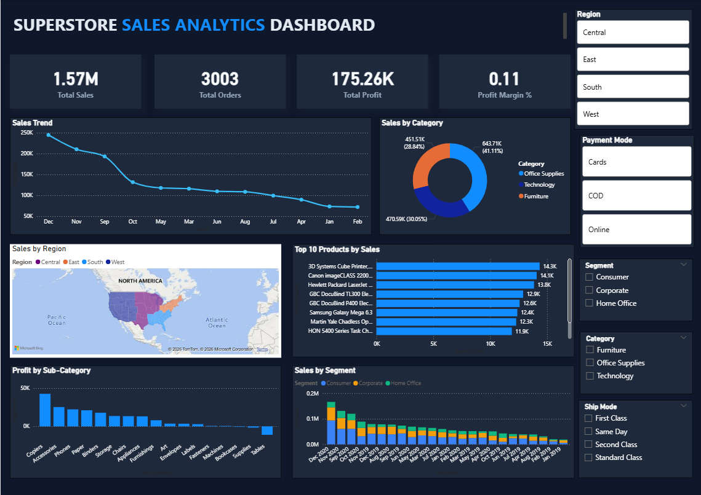

# Power BI Sales Dashboard

## Project Overview

This Power BI dashboard provides insights into sales performance, profitability, customer trends, and regional performance using the Superstore dataset.

## Business Problem

Organizations need visibility into:

- Revenue performance
- Profitability trends
- Regional sales distribution
- Product category performance
- Key business KPIs

This dashboard helps stakeholders make data-driven decisions by presenting critical metrics in an interactive format.

---

## Tools Used

- Power BI
- DAX
- Data Modeling
- Data Visualization

---

## Dashboard Features

### KPI Cards

- Total Sales
- Total Profit
- Total Quantity Sold
- Profit Margin

### Sales Analysis

- Sales Trends
- Category Performance
- Sub-Category Performance

### Regional Analysis

- Region-wise Sales
- Region-wise Profitability

### Interactive Features

- Slicers
- Filters
- Drill-down Analysis

---

## Key Business Insights

### Revenue

- Technology generated the highest revenue.
- Phones were among the top-selling products.

### Profitability

- Copiers generated the highest profit.
- Tables showed negative profitability despite strong sales.

### Regional Performance

- West region generated the highest sales and profit.
- Central region showed the lowest profit margin.

---

## Dashboard Preview

### Main Dashboard

---

## Project Files

- SUPERSTORE.pbix
- Sample Superstore Dataset
- Dashboard Screenshots

---

## Author

Simran Sonawane

GitHub:
https://github.com/simransonawane24
